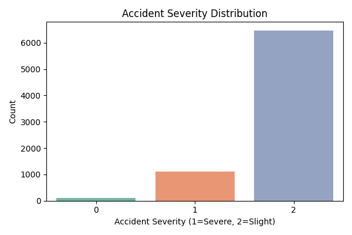
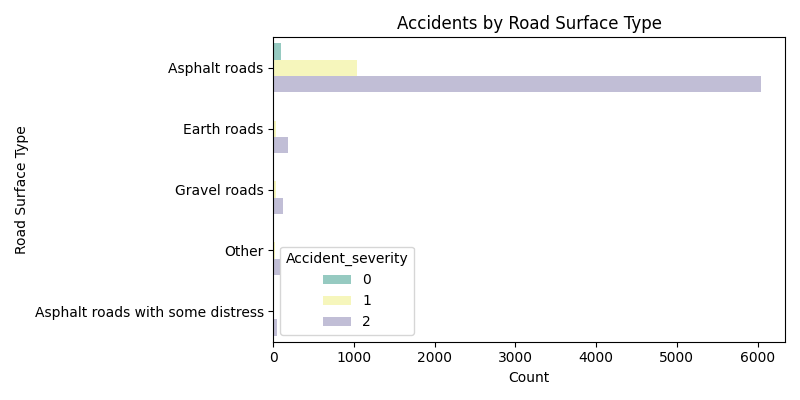
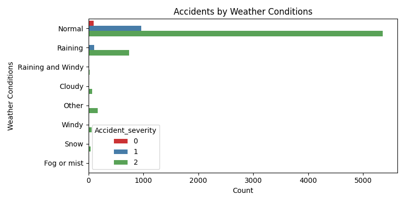
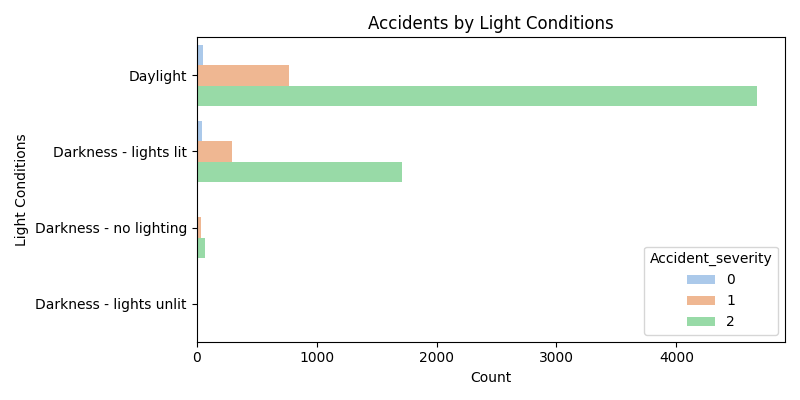
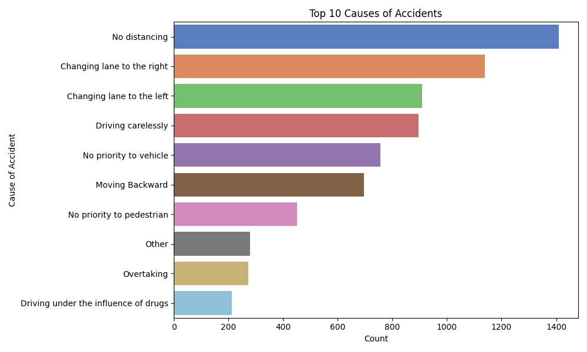

# Task 5: Analyze Traffic Accident Data

Analyze traffic accident data to identify patterns related to road conditions, weather, and time of day. Visualize accident hotspots and contributing factors to understand and prevent accident occurrences.


## 📊 Objective

The objective of this task is to extract insights from traffic accident data, focusing on environmental and situational factors such as weather, lighting, and road surface. This helps in identifying contributing factors and patterns for accident prevention.


## 📁 Dataset

The dataset contains the following columns:

- `Age_band_of_driver`  
- `Sex_of_driver`  
- `Educational_level`  
- `Vehicle_driver_relation`  
- `Driving_experience`  
- `Lanes_or_Medians`  
- `Types_of_Junction`  
- `Road_surface_type`  
- `Light_conditions`  
- `Weather_conditions`  
- `Type_of_collision`  
- `Vehicle_movement`  
- `Pedestrian_movement`  
- `Cause_of_accident`  
- `Accident_severity`


## 🛠️ Technologies Used

- Python  
- Pandas  
- Seaborn  
- Matplotlib  


## 📦 Dependencies
```bash
    pip install pandas matplotlib seaborn
```

## 📌 Output

The script generates and saves the following visualizations:

- `severity_distribution.png`  
- `road_surface_vs_severity.png`  
- `weather_vs_severity.png`  
- `light_conditions_vs_severity.png`  
- `top_causes.png`  

## 🚀 How to Run

1. Make sure `dataset.csv` is in the same directory as the script.
2. Run the script:
```bash
    python script.py
```

## Visualization
- **Severity Distribution**
  
- **Road Surface VS Severity**
  
- **Weather VS Severity**
  
- **Light Conditions VS Severity**
  
- **Top Causes**
  
  
## 📈 Result

The visualizations reveal patterns such as:

- Most accidents occur on asphalt roads in daylight and normal weather conditions.  
- Certain accident causes like "No distancing" and "Changing Lanes" are dominant.  
- Slight injuries are more frequent than severe injuries.


## ✅ Task Completed

Task 5 has been successfully completed with data cleaning, analysis, and visualization of accident severity in relation to environmental and situational conditions.
